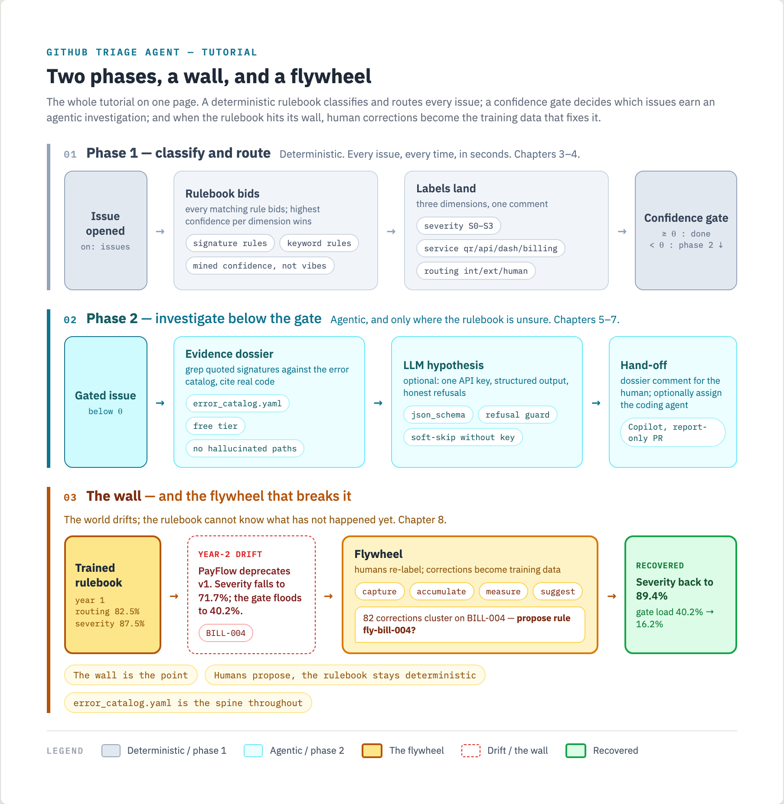

# github-triage-agent-tutorial

Build an issue-triage agent from stock GitHub. No servers, no training
infra, no bespoke stack: Actions, issues, labels, one Python script, the
Copilot coding agent, Copilot code review, one ruleset.

The pattern is two-phase: a deterministic rulebook classifies severity
and routes each issue (internal service, external vendor, or human),
then a confidence gate decides whether an agentic investigation reads
the code before anyone acts. This tutorial builds that pattern at
teaching scale, on a fictional company called Jane's Jeans, an online
jeans store with four services and two years of issue history.

You train the rulebook yourself, wire it to Actions, watch it hit a
wall around 80%, and build the flywheel that turns human corrections
into rulebook improvements. The wall is the point.



## how this tutorial works

You write the code. Each layer's working file lives in `triage/` with
the plumbing given and the core functions stubbed. A stub raises
`NotImplementedError` with its chapter number, and its docstring is the
contract you build to. The finished versions live in `solutions/`, for
comparison after, not before.

The test suite is the progress meter. A fresh clone runs green with a
block of skips, one per unwritten chapter:

```bash
python -m pytest tests/ -q
# 27 passed, 38 skipped   <- skips tick down as you build
```

Each chapter ends with its own gate, `pytest tests/chapters/test_ch0N.py -q`.
All green means your implementation matches the chapter's numbers, and
the skips in the full suite drop with it.

## prereqs

- a GitHub account and the `gh` CLI, authed
- Python 3.11+ and Node 18+ (the dashboard is a small React app)
- optional, layer 6 only: any Anthropic API key, cost per issue runs to
  a few cents
- optional, layer 7 only: a paid Copilot plan with the coding agent
  enabled

Layers 0 through 5 and 8 through 9 run entirely free. Layer 6 needs one
API key and a small per-issue spend. Layer 7 needs the Copilot seat.

No other accounts. The payment vendor in the demo is fictional and
stubbed locally.

## never commit a token

This tutorial has you handle two real credentials: an Anthropic API key
(layer 6) and a GitHub token (layer 7). A leaked key gets scraped off
public GitHub within minutes and billed to you. There are exactly two
safe ways to handle either one, and both are used in this repo:

1. **Keep it local and never check it in.** For anything you run on your
   own machine, put the key in an environment variable or a `.env` file
   that git ignores. `.env` is already in `.gitignore` here. The code
   reads keys from the environment, never from a committed file.
2. **Give it to GitHub the secure way.** For anything a workflow runs,
   store the token as a GitHub Actions secret with `gh secret set NAME`.
   Secrets are write-only, masked in logs, and never land in your files.
   Workflows read them as `${{ secrets.NAME }}`.

Never do the third thing: pasting a key into a YAML file, a Python file,
a commit, or a `git push`. Turn on **Settings, Advanced Security, secret
scanning and push protection** so GitHub blocks a token at push time if
you slip. Both humans and coding agents slip on this, which is why the
guardrails exist.

## start here

The tutorial runs in layers, each with a checkpoint:

0. [concepts](docs/tutorial/00-concepts.md): Actions vocabulary, the two Copilots
1. [the product](docs/tutorial/01-the-product.md): tour the monorepo, meet the error catalog
2. [the corpus](docs/tutorial/02-the-corpus.md): two years of issues, mine the patterns
3. [train the rulebook](docs/tutorial/03-train-the-rulebook.md): the training protocol, to the wall
4. [wire it to actions](docs/tutorial/04-wire-to-actions.md): labels are the API
5. [the investigation](docs/tutorial/05-the-investigation.md): evidence dossiers, no LLM
6. [the llm hypothesis](docs/tutorial/06-the-llm-hypothesis.md): one API key, a real hypothesis
7. [the coding agent](docs/tutorial/07-the-coding-agent.md): hand off, get a PR, auto-review
8. [build the flywheel](docs/tutorial/08-build-the-flywheel.md): corrections become rules
9. [going further](docs/tutorial/09-going-further.md): your own repo, costs, limits

## quick check

```bash
pip install -r requirements.txt
python -m pytest tests/ -q          # green, plus one skip block per unbuilt chapter
python tools/mine_patterns.py       # the signal tables
python -m triage.eval --year 1 --rulebook triage/rulebook.starter.yaml
```

If that last number is around 30%, you're set up right. Making it not
30% is layer 3.
