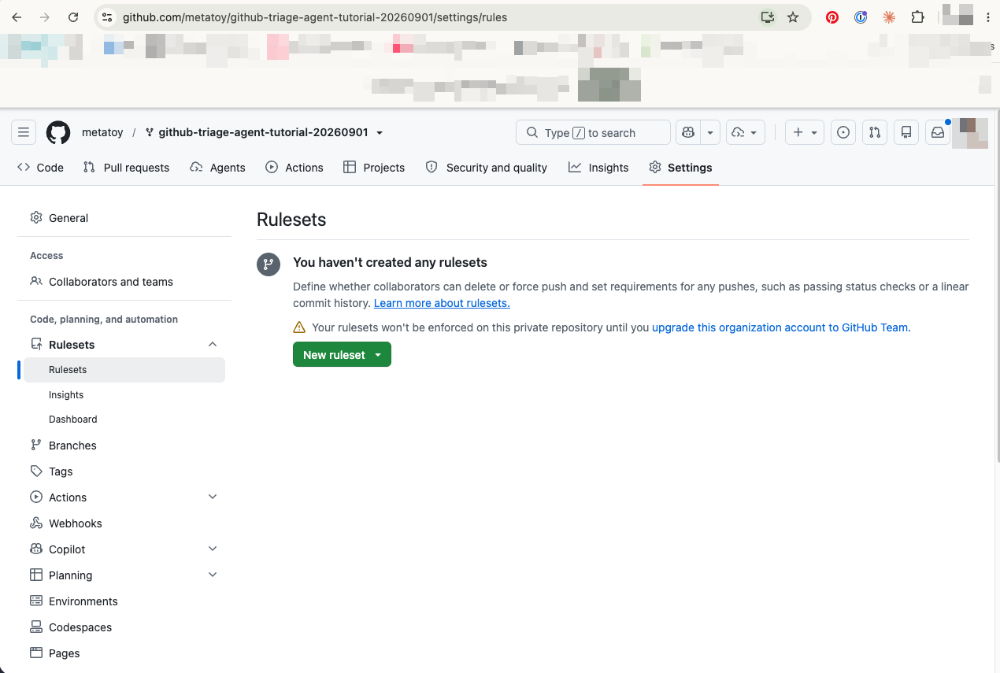

# 0. Concepts

This tutorial rebuilds a two phase triage agent out of stock GitHub parts.
Before touching the repo you need two vocabularies: what GitHub Actions
actually means when people say "action," and which of the two things
called "Copilot" does which job. Get these confused and the later layers
will not make sense.

Here is the whole build on one page. Layers 3 and 4 build the top row,
5 through 7 the middle row, and 8 the bottom one.


## GitHub Actions, the vocabulary

"GitHub Actions" is the automation platform built into GitHub. The word
"action" gets overloaded, so pin down five terms:

- **Workflow.** A YAML file in `.github/workflows/` that says "when X
  happens, run these steps."
- **Event / trigger** (`on:`). What starts the workflow: `push`,
  `pull_request`, `issues`, `schedule` (cron), `workflow_dispatch`
  (manual), and others.
- **Job.** A unit of work that runs on a runner, a fresh VM. GitHub hosts
  `ubuntu-latest` for you, or you can bring your own.
- **Step.** One thing inside a job. Either shell (`run: python foo.py`)
  or a reusable action (`uses: actions/checkout@v4`).
- **An action** (the noun). A packaged, reusable step someone published:
  checkout, setup-python, and thousands more.

The model end to end: event triggers a workflow, the workflow runs one or
more jobs on a runner, each job runs its steps in order.

## CI vs CD, for context

- **CI, continuous integration.** Merge to a shared branch often, every
  change auto builds and tests, integration problems surface in minutes
  instead of weeks.
- **CD** splits into two things people conflate: **continuous delivery**,
  where every passing change is packaged and ready to ship but a human
  clicks deploy, and **continuous deployment**, where every passing
  change ships to production automatically with no human gate.

Naming which one you mean is the tell that you know the distinction.

## Two things called Copilot

There are two different Copilots in this tutorial, and they do different
jobs.

1. **Copilot code review.** Reviews a pull request diff. It comments on
   changes, it does not review "a monorepo" in the abstract. It needs a
   PR to look at.
2. **Copilot coding agent.** The autonomous one. You assign an issue to
   it, it works in the repo on a branch, makes changes, and opens a PR.
   This is the surface that "works on code in a monorepo."

### Triggering Copilot code review on a PR

Prereq: a paid Copilot plan that includes code review, Pro, Pro+,
Business, or Enterprise. Not in the free tier.

Manual, per PR: open the PR, click the Reviewers gear, select Copilot.
It reviews in about 30 seconds and posts inline comments plus a summary.

Automatic on every PR: create a repository ruleset. Repo Settings, Rules,
Rulesets, New branch ruleset, target the default branch, enable "Request
pull request review from Copilot."



One honest caveat, visible in that screenshot: on a private repo inside
an org, rulesets only enforce on a paid Team plan. On a public repo, or
a personal private one, they enforce fine on the free tier.

Draft PRs are skipped. The auto review fires when a PR is opened ready
for review, or moved from draft to ready for review. Iterate freely in
draft, click "Ready for review" to trigger the review.

Re-review on new commits is not always automatic. Re-request it from the
Reviewers panel, the refresh icon next to Copilot.

Copilot's review comments are advisory by default. They do not block
merge unless you also add a required-review branch rule.

## The target pipeline: issue to Python to Copilot in a monorepo

```yaml
on:
  issues:
    types: [opened]

jobs:
  handle-issue:
    runs-on: ubuntu-latest
    permissions:
      contents: write
      issues: write
      pull-requests: write
    steps:
      - uses: actions/checkout@v4          # the whole monorepo
      - uses: actions/setup-python@v5
      - run: python scripts/triage.py       # your Python step (parse issue, decide scope, label)
      # then hand the issue to the Copilot coding agent:
      - run: gh issue edit ${{ github.event.issue.number }} --add-assignee "@copilot"
        env: { GH_TOKEN: ${{ secrets.PAT }} }
```

Flow: `issues.opened` fires, the runner checks out the monorepo, Python
does triage and prep, the issue gets assigned to the Copilot coding
agent, the agent works in the repo and opens a PR, and the ruleset from
the review section auto requests Copilot code review on that PR. Two
agents chained: one does the work, one reviews it.

This snippet is illustrative, not the real workflow. Layer 4 walks the
actual `.github/workflows/triage.yml` in this repo block by block, and it
differs from this sketch in one important way: the default `GITHUB_TOKEN`
is enough for labeling and commenting, and only the Copilot assign step
needs a PAT.

### Gotchas that will actually bite

- **Review vs. work.** Decide up front which Copilot you mean. "Review
  code in a monorepo" with no PR in sight really means the agent to PR
  to review chain above, not a standalone review.
- **Plan gating.** The coding agent needs the right Copilot tier,
  Business or Enterprise, or Pro+ depending on your account, and it has
  to be enabled for the repo. Verify before you build around it.
- **Token permissions.** The default `GITHUB_TOKEN` cannot kick off other
  automations and cannot do everything, including assigning issues to
  the Copilot agent. Use a PAT or a GitHub App token for that step.
- **Loop prevention.** Actions triggered by `GITHUB_TOKEN` deliberately
  do not trigger further workflows, an anti recursion guard. Rulesets are
  not workflows, so the Copilot review ruleset still fires on the
  agent's PR, but workflow to workflow chaining needs a PAT.
- **Monorepo scoping.** `on: issues` has no path filter. You scope "only
  touch `packages/billing/`" in the Python step, and in a
  `copilot-instructions.md` the agent reads to stay in bounds.

## Open item to verify

The exact API or `gh` call to assign an issue to the Copilot coding agent
from within an Action is the piece most likely to have changed by the
time you read this. Confirm against current GitHub docs before relying on
it. Layer 7 covers the current method and why it lives in its own file.

## Checkpoint

You should now be able to say, without looking anything up: what the four
parts of a workflow are, the difference between continuous delivery and
continuous deployment, and which Copilot you would reach for if someone
asked you to "have the agent fix this monorepo issue" versus "have the
agent review this PR." If any of those are fuzzy, reread the relevant
section before layer 1, the rest of the tutorial assumes this vocabulary.

## the heavy version

Picture Jane's Jeans at 300 engineers and 40 services instead of four. At
that scale you would not lean on a third party coding agent to write
fixes. You would pair a trained routing model with specialist agents
that have scoped, audited access to the codebase and their own deploy
path. The GitHub vocabulary in this layer, events, jobs, permissions,
tokens, is still the substrate under any of that: even a Jane's Jeans
this size would run its retraining jobs and its agent orchestration on
top of the same event driven, permission scoped automation model you
just read about. What changes at scale is who owns the "coding agent"
role, not whether the event to job to step shape holds.
