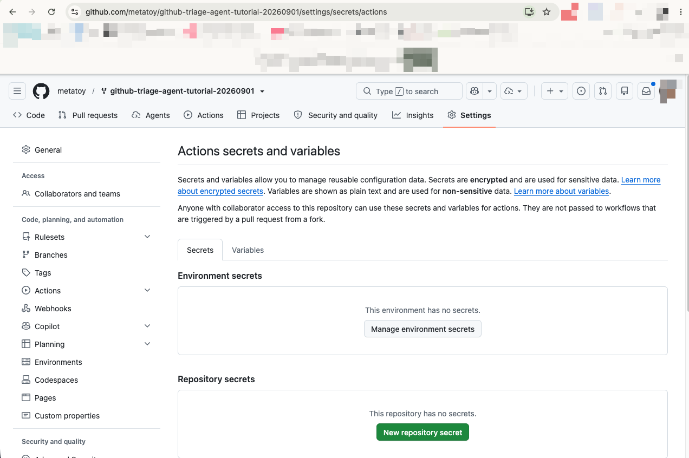
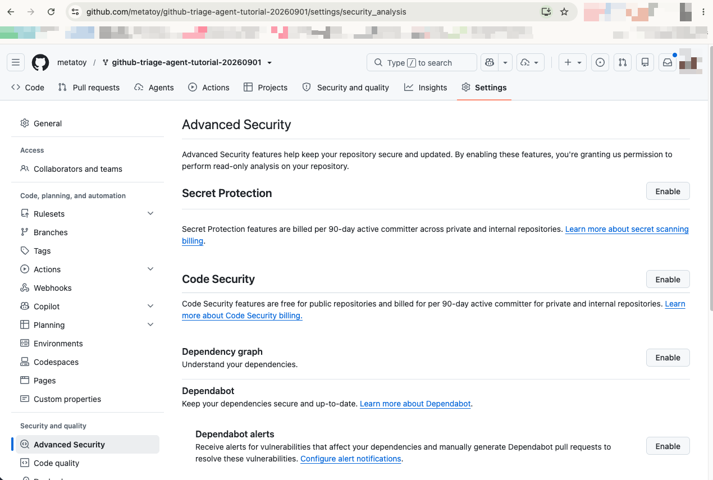

# Layer 6: the LLM hypothesis

Layer 5 built a dossier with zero LLM calls: grep, git log, a fleet
search. That dossier is evidence, not a hypothesis. This layer takes
the jump from evidence to hypothesis and hands it to a model, one API
key, no Copilot seat required.

Your working copy is `triage/investigate_llm.py`. The anthropic SDK
plumbing is given: client construction, the model id, the
adaptive-thinking API call itself, because calling the API is not the
lesson. The soft-skip when `ANTHROPIC_API_KEY` is missing is given too,
that's a safety rail, not a lesson, and it keeps behaving identically
no matter what you do to the rest of the file. `gather_files` and
`render` are given and fully working. The three functions that are the
lesson raise `NotImplementedError` until you write them: `build_prompt`,
`validate_hypothesis`, `apply_refusal_guard`. `solutions/investigate_llm.py`
is the finished version, for comparison after you've built it, not
before.

Your gate for this layer:

```bash
python3 -m pytest tests/chapters/test_ch06.py -q
```

On a fresh clone every test in it skips with "chapter 6 not started".
As you land each step, its tests flip from skipped to green, and none
of them need a key or a network call, they run against a fixture
dossier built right in the test file.

## setup

Add the key as a repository secret:

```bash
gh secret set ANTHROPIC_API_KEY
```

You'll be prompted to paste the key, it never touches your shell
history this way. Locally, set the same variable in your environment
before running the module by hand.

The same store lives in the UI at Settings, Secrets and variables,
Actions, under Repository secrets. Either door writes the same secret,
and the value is write-only either way.



While you're in Settings, flip on Secret Protection under Advanced
Security. Push protection blocks a key that slips into a commit at
push time, before it ever reaches the remote.



Those are the only two places the key ever belongs: a GitHub secret for
the workflow, or a local environment variable for hand runs. Never paste
it into a file you commit. If you keep it in a `.env` for local work,
confirm `.env` is git-ignored (it is, in this repo). See "never commit a
token" in the README for why.

Cost is one model call per issue that clears the confidence gate, not
per issue. Most issues resolve in phase 1 and never reach this step.
At tutorial volume that's cents, not dollars. If you want to trade
hypothesis depth for a cheaper call, `TRIAGE_LLM_MODEL` overrides the
default model, set it to whatever your provider account has access to.

## step 1: build_prompt

`main()` reads the key first, and if it's missing, prints a note to
stderr and returns 0, no crash, the pipeline keeps running without this
step. That guard is given, don't touch it.

Once there's a key, `ask_claude()` needs one string to send the model:
the issue, the dossier's evidence, and the suspect source files, all in
one structured-output request. There's no follow-up turn here, so
`build_prompt` has to put everything the model needs to reason about
into that single call. Open `triage/investigate_llm.py`, read
`build_prompt`'s docstring, and implement it: render the suspect files
as labeled blocks, render the dossier's evidence as JSON, and wrap both
in the framing and ground rules the prompt needs.

Until `build_prompt` exists, running the module dies with
`NotImplementedError: chapter 6`, same shape as every other layer in
this tutorial, the scaffold runs, the core is yours.

## the raise-site rule, taught to the model

Layer 5 taught you the catalog-prior lesson by hand: a grep hit on the
vendor client is where the error surfaces, not proof the fault is
ours. The prompt you're building teaches the same rule to the model
directly:

```
- a grep hit can be the RAISE SITE of a vendor-side error, not the cause.
  If the catalog prior says external and the fleet corroborates, the code
  match does not make it internal.
```

Same lesson, now as an instruction instead of code you read. The model
gets the deterministic dossier's `revised` call as part of its
evidence, so it isn't reasoning from scratch, it's reasoning from the
same evidence layer 5 already gathered. The prompt also tells the model
`confidence must be honest, low evidence means low confidence`, and
that `routing "human"` is a valid answer. A hypothesis step that's
rewarded for sounding certain is worse than no hypothesis step, which
is exactly what step 3 below exists to enforce even when the model
doesn't hold up its end.

## step 2: validate_hypothesis

`ask_claude()` asks for structured output constrained to
`HYPOTHESIS_SCHEMA`: `hypothesis`, `routing`, `confidence`,
`suspect_files`, `fix_direction`. Structured outputs make a malformed
response unlikely, but this pipeline posts straight to a public issue
tracker, and "the API is supposed to guarantee this" is a different
claim from "I checked before I trusted it." Implement
`validate_hypothesis` next: confirm every required key is present and
no extra ones snuck in, `routing` is one of the three allowed values,
`confidence` sits in `[0.0, 1.0]`, `suspect_files` is a list of
strings, and `hypothesis` plus `fix_direction` are non-empty. Raise
`ValueError` naming the problem on any violation, otherwise hand the
verdict back unchanged.

## step 3: apply_refusal_guard

Two things can go wrong even with a schema-valid response: the model
can refuse outright (`response.stop_reason == "refusal"`), or it can
answer with real routing and real evidence at a confidence too thin to
act on. Both cases deserve the same honest fallback, a human, not a
confident-sounding automated call. Implement `apply_refusal_guard`:
a refusal becomes a synthetic verdict routed to a human at confidence
`0.0`, and a low-confidence verdict (below `CONFIDENCE_FLOOR`, `0.3`)
keeps everything the model said, hypothesis, suspect files, fix
direction, and gets only its `routing` overridden to `"human"`. A
verdict above the floor passes through untouched.

`ask_claude()` wires all three functions together: build the prompt,
make the given API call, then validate and guard whatever comes back.
Every path through it, refusal or not, now ends in a postable verdict.

## run it

```bash
grep -m1 'webhook signature' data/issues/year1.ndjson > /tmp/wh.json
python3 -m triage.investigate_llm --issue /tmp/wh.json --service billing
```

```
<!-- triage-llm:v1 {"v": 1, "kind": "llm-hypothesis", "issue": 2, "model": "claude-opus-4-8", "hypothesis": "PayFlow-side webhook signatures are failing verification fleet-wide; the billing code line is only the raise site for a vendor verification failure, not the root cause.", "routing": "external", "confidence": 0.7, "suspect_files": ["services/billing/webhooks.py", "services/billing/vendor_stub.py"], "fix_direction": "Confirm with PayFlow whether they rotated signing secrets or changed the signature scheme this morning; also sanity-check the recent billing commit didn't alter the mode/secret passed into verify_webhook_signature."} -->
### investigation (phase 2b, LLM hypothesis)

**hypothesis:** PayFlow-side webhook signatures are failing verification fleet-wide; the billing code line is only the raise site for a vendor verification failure, not the root cause.

**routing call:** `external` at 0.70 (deterministic pass said: external, corroborated)

**suspect files**
- `services/billing/webhooks.py`
- `services/billing/vendor_stub.py`

**fix direction:** Confirm with PayFlow whether they rotated signing secrets or changed the signature scheme this morning; also sanity-check the recent billing commit didn't alter the mode/secret passed into verify_webhook_signature.

model: `claude-opus-4-8` · evidence from the phase-2a dossier above. want a fix attempt? comment `/handoff` to send this to the coding agent.
```

Worth sitting with this one. `data/error_catalog.yaml` marks BILL-002,
webhook signature failures, as the genuinely hard case, resolutions
split roughly 60/40 between vendor key rotation and our own
misconfiguration. The model called it external at 0.70, a reasonable
read given the evidence, not a confident one. That's the calibration
the prompt asked for: a hard case gets a moderate confidence number,
not a model dialing to 0.95 because certainty sounds more useful.
Ground truth for this specific issue happens to be internal, one of
the 40%. The model wasn't wrong to hedge, this is exactly the case
where hedging is the honest answer, and 0.70 clears `CONFIDENCE_FLOOR`
comfortably, so `apply_refusal_guard` leaves the routing call alone.

Contrast that with a vague, thinly-worded report on a signature that
barely matches anything in the catalog. Run enough of those through
the pipeline and you'll see the model answer honestly at a confidence
like `0.25`, still guessing `external` or `internal` because the
schema requires some routing value, but not standing behind that guess.
That's the case `apply_refusal_guard` exists for: it keeps the model's
hypothesis and fix direction (both still useful context for whoever
looks at the issue next) and overrides only the routing call to
`"human"`, so a `0.25` never quietly reads as a confident automated
decision.

You have that exact ticket live if you seeded layer 4: `checkout is
broken, customers cant buy` gated with nothing in the body worth
grepping. Pull it down and run it:

```bash
gh issue view <n> --json title,body,number > /tmp/vague.json
python3 -m triage.investigate_llm --issue /tmp/vague.json --service api
```

Expect the honest shape, not a specific hypothesis: a low confidence
around `0.2` to `0.3`, routing overridden to `human` by your guard,
and suspect files that read like guesses because that's all the
evidence supports. If your run comes back at `0.9` on that body,
your prompt is inviting confidence instead of asking for calibration.

## checkpoint

Run the gate:

```bash
python3 -m pytest tests/chapters/test_ch06.py -q
```

Ten green, none skipped. You should now see a posted hypothesis with a
routing call, a confidence number that isn't pinned to 0.99, named
suspect files, and a fix direction, all sourced from the same dossier
layer 5 built. On a repo with no `ANTHROPIC_API_KEY` set, the same
workflow run produces no comment from this step and no failure, the
pipeline degrades to layer 5's dossier alone. On a report too thin to
route with confidence, the comment still posts, honestly routed to a
human instead of a confident guess.

### the heavy version

One model call per gated issue is cheap at Jane's Jeans' current
volume. Grown to thousands of issues a month across dozens of
services, that per-call API cost would start to matter, and the
answer wouldn't be to call the API less, it would be to stop paying
per call at all. At that scale you'd run a trained engine in a service
you own, amortizing the cost across every triage instead of metering
it per issue, with the same structured-output contract this module
already uses so nothing downstream would need to change. The raise-
site rule, the honest-confidence instruction, and the low-confidence
guard wouldn't move to a service either, they'd stay exactly what they
are here: the part of the prompt, the part of the training data, and
the part of the calling code, that keeps a hypothesis-generating step
from being more confident than its evidence supports.
